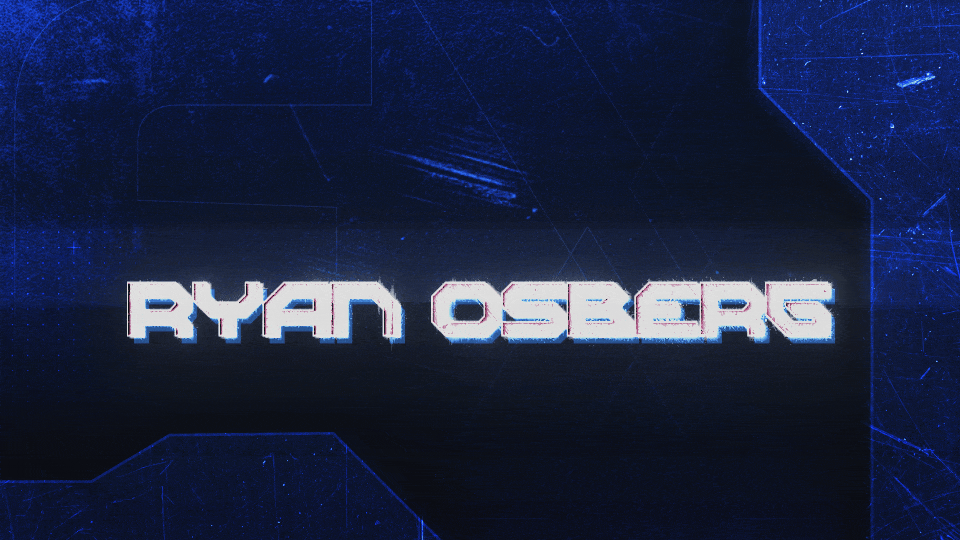

Hello There!👋  I'm Ryan, an aspiring programmer and designer. 
I am currently enrolled at the University of Wisconsin-Whitewater working towards a Bachelor's degree in “Media Arts and Game Development” along with a minor in Cybersecurity. 

I have knowledge in varying coding languages from C++ to Python along with different game engines such as Unity and Unreal.
I have a passion for games because the combination of technology and creativity creates vast opportunities for imagination and innovation. 

&nbsp;
 

  
   
  
  

 

