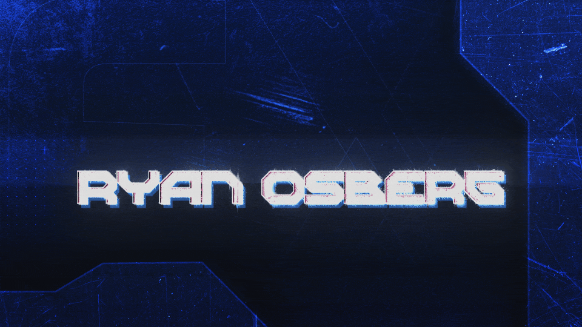

Hello There!👋  I'm Ryan, A creative programmer and game designer with a B.S. in “Media Arts and Game Development” and a minor in Cybersecurity. 

I have knowledge in varying coding languages from C++ to Python along with different game engines such as Unity and Unreal.
I have a passion for interactive and digital media because the combination of technology and creativity creates opportunities for imagination and innovation. 

&nbsp;
 

  
   
  
  

 

